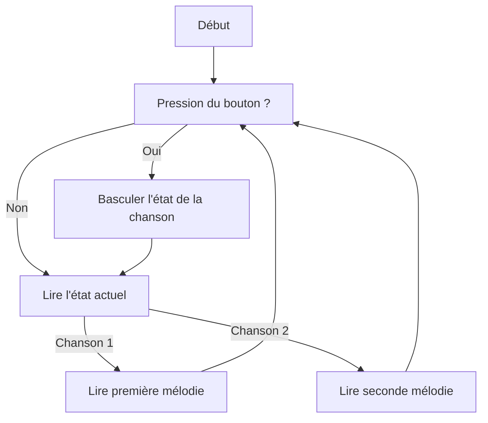

# Projet Buzzer et Capteur Rotatif avec Raspberry Pi Pico

## Contexte
Ce projet utilise un **Raspberry Pi Pico** pour créer un système musical interactif. Un **capteur rotatif** ajuste le volume du son, un **bouton poussoir** permet de basculer entre deux mélodies, et un **buzzer** joue des notes musicales. Le programme est écrit en **MicroPython**.

## Fonctionnalités
- **Capteur rotatif** : Utilisé pour ajuster le volume du buzzer en fonction de la rotation.
- **Bouton poussoir** : Permet de basculer entre deux mélodies.
- **Buzzer** : Joue des mélodies à différentes fréquences en fonction du volume et du bouton poussoir.

## Schéma de câblage
- **Pin 0** : Capteur rotatif (ADC)
- **Pin 16** : Bouton poussoir (entrée numérique)
- **Pin 27** : Buzzer (PWM)

## Flowchart

